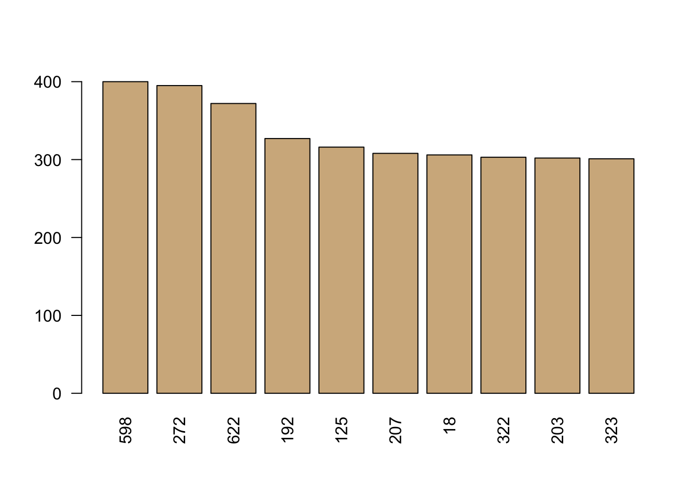

# Working with Text Data in R

## Setup

### Packages

In R, and most programming languages, there are many packages - code written by other people to help with certain tasks. 
For this workshop we will be using two packages - 'tm' and 'ggplot2'.
The 'tm' - text mining - package has methods for mining text with R including importing data, storing corpora, applying operations on corpora (such as common preprocessing methods), and document term matrices.
The 'ggplot2' package has functions related to plotting and visualizing data.


Run this command if you don't already have these packages installed.

```r
install.packages('tm')
install.packages('ggplot2')
install.packages('Matrix')
```

Once the packages are installed, load them into your R environment.

```r
library('tm')
library('ggplot2')
library('Matrix')
```

You can find the documentation for the package [online](https://cran.r-project.org/web/packages/tm/tm.pdf)\
Within R/RStudio you can browse function documentation with the following syntax.
```
?TermDocumentMatrix
```

###  Data for this workshop

For this workshop, we are looking at a set of abstracts of medical journal articles related to breast cancer.
We have 714 abstracts, stored in a csv, with duplicates. 
We would like to get the key words from each abstract, as well as visualize / check for groupings of abstracts in two dimensions.\


```r
data <- read.csv(url("https://ucdavisdatalab.github.io/workshop-nlp-healthcare/abstracts.csv"), stringsAsFactors=FALSE)
```


```r
head(data)
```

```
##   authors year
## 1         2008
## 2         2014
## 3         2015
## 4         2016
## 5         2016
## 6         2017
##                                                                                                                                                                                                                                                                                                           title
## 1                                                                                                                                                     The UK Standardisation of Breast Radiotherapy (START) Trial B of radiotherapy hypofractionation for treatment of early breast cancer: a randomised trial.
## 2 Erratum: Effect of radiotherapy after mastectomy and axillary surgery on 10-year recurrence and 20-year breast cancer mortality: meta-analysis of individual patient data for 8135 women in 22 randomised trials (The Lancet (2014) 383(9935) (2127–2135)(S0140673614604888)(10.1016/S0140-6736(14)60488-8)).
## 3                                                                                                                                                                                                                   Proceedings of the American Society for Radiation Oncology 57th Annual Meeting, ASTRO 2015.
## 4                                                                                                                                                                                              Late-Breaking Abstracts from the 57th Annual Meeting of the American Society for Radiation Oncology, ASTRO 2015.
## 5                                                                                                                                                                                                                                       Proceedings of the American Society for Radiation Oncology, ASTRO 2016.
## 6                                                                                                                                                                                                                                                            2017 ASTRO Annual Meeting Late-Breaking Abstracts.
##                                                       journal
## 1                                                  The Lancet
## 2                                                  The Lancet
## 3 International Journal of Radiation Oncology Biology Physics
## 4 International Journal of Radiation Oncology Biology Physics
## 5                 International Journal of Radiation Oncology
## 6 International Journal of Radiation Oncology Biology Physics
##                                                                                                                                                                                                                                                                                                                                                                                                                                                                                                                                                                                                                                                                                                                                                                                                                                                                                                                                                                                                                                                                                                                                                                                                                                                                                                                                                                                                                                                                                                                                                                                                                                                                                                                                                                                                                                                                                                                                                                                                                                                                                                                                                                                                                                 text
## 1 Background: The international standard radiotherapy schedule for early breast cancer delivers 50 Gy in 25 fractions of 2·0 Gy over 5 weeks, but there is a long history of non-standard regimens delivering a lower total dose using fewer, larger fractions (hypofractionation). We aimed to test the benefits of radiotherapy schedules using fraction sizes larger than 2·0 Gy in terms of local-regional tumour control, normal tissue responses, quality of life, and economic consequences in women prescribed post-operative radiotherapy. Methods: Between 1999 and 2001, 2215 women with early breast cancer (pT1-3a pN0-1 M0) at 23 centres in the UK were randomly assigned after primary surgery to receive 50 Gy in 25 fractions of 2·0 Gy over 5 weeks or 40 Gy in 15 fractions of 2·67 Gy over 3 weeks. Women were eligible for the trial if they were aged over 18 years, did not have an immediate reconstruction, and were available for follow-up. Randomisation method was computer generated and was not blinded. The protocol-specified principal endpoints were local-regional tumour relapse, defined as reappearance of cancer at irradiated sites, late normal tissue effects, and quality of life. Analysis was by intention to treat. This study is registered as an International Standard Randomised Controlled Trial, number ISRCTN59368779. Findings: 1105 women were assigned to the 50 Gy group and 1110 to the 40 Gy group. After a median follow up of 6·0 years (IQR 5·0-6·2) the rate of local-regional tumour relapse at 5 years was 2·2% (95% CI 1·3-3·1) in the 40 Gy group and 3·3% (95% CI 2·2 to 4·5) in the 50 Gy group, representing an absolute difference of -0·7% (95% CI -1·7% to 0·9%)-ie, the absolute difference in local-regional relapse could be up to 1·7% better and at most 1% worse after 40 Gy than after 50 Gy. Photographic and patient self-assessments indicated lower rates of late adverse effects after 40 Gy than after 50 Gy. Interpretation: A radiation schedule delivering 40 Gy in 15 fractions seems to offer rates of local-regional tumour relapse and late adverse effects at least as favourable as the standard schedule of 50 Gy in 25 fractions.
## 2                                                                                                                                                                                                                                                                                                                                                                                                                                                                                                                                                                                                                                                                                                                                                                                                                                                                                                                                                                                                                                                                                                                                                                                                                                                                                                                                                                                                                                                                                                                                                       EBCTCG (Early Breast Cancer Trialists' Collaborative Group). Effect of radiotherapy after mastectomy and axillary surgery on 10-year recurrence and 20-year breast cancer mortality: meta-analysis of individual patient data for 8135 women in 22 randomised trials. Lancet 2014; 383: 2127–35—During revision of the appendix of this Article after peer review, some analyses of local recurrence were omitted. These have now been restored in the updated appendix. All analyses (and page numbers) in the previous version of the appendix remain unchanged, as do the medical findings of the paper. The correction has been made to the appendix as of Nov 21, 2014.
## 3                                                                                                                                                                                                                                                                                                                                                                                                                                                                                                                                                                                                                                                                                                                                                                                                                                                                                                                                                                                                                                                                                                                                                                                     The proceedings contain 2121 papers. The topics discussed include: radiation treatment parameters and late gastrointestinal toxicity in cervical cancer patients treated with image guided high-dose-rate brachytherapy; the effect of pelvic radiation therapy on vaginal brachytherapy cylinder size; role of radiation therapy in platinum-resistant recurrent ovarian cancer diagnosed by FDGPET/contrast-enhanced CT; inferior outcomes following definitive radiation therapy or concurrent chemoradiation therapy for adenocarcinoma than squamous cell carcinoma of uterine cervix: a matched case control study; first safety analysis after 80 treated patients with early breast cancer within the targit-e trial; accelerated partial-breast irradiation (APBI) provides equivalent 5 year and 10 year outcomes regardless of molecular subtype; and breast cancer patients' preferences for adjuvant radiation therapy post lumpectomy, whole-breast irradiation versus partial-breast irradiation: a single-institutional study.
## 4                                                                                                                                                                                                                                                                                                                                                                                                                                                                                                                                                                                                                                                                                                                           The proceedings contain 12 papers. The topics discussed include: dexamethasone versus placebo in the prophylaxis of radiation-induced pain flare following palliative radiation therapy for bone metastases: a double-blind randomized, controlled, superiority trial; hypofractionated versus conventionally fractionated radiation therapy for prostate cancer: five-year oncologic outcomes of the Dutch randomized phase 3 HYPRO trial; patient-reported outcomes in NRG oncology/RTOG 0938, a randomized phase 2 study evaluating 2 ultrahypofractionated regimens (UHRs) for prostate cancer; report of NRG oncology/RTOG 9601, a phase 3 trial in prostate cancer: anti-androgen therapy (AAT) with bicalutamide during and after radiation therapy (RT) in patients following radical prostatectomy (RP) with pT2-3pN0 disease and an elevated PSA; NRG oncology RTOG 0415: a randomized phase 3 noninferiority study comparing 2 fractionation schedules in patients with low-risk prostate cancer; accelerated partial breast irradiation using sole interstitial multicatheter brachytherapy versus whole breast irradiation for early breast cancer: five-year results of a randomized phase 3 trial - part I: local control and survival results; preclinical advances in combined-modality cancer immunotherapy with radiation therapy; and examination of industry payments to radiation oncologists in 2014 using the centers for medicare and medicaid services open payments database.
## 5                                                                                                                                                                                                                                                                                                                                                                                                                                                                                                                                                                                                                                                                                                                                                                                                                                                                                                                                                                                                                                                                                                                                                                                                                                                                                                                                       The proceedings contain 2300 papers. The topics discussed include: a phase III randomized control trial comparing skin-sparing helical tomotherapy versus 3D-conformal radiation therapy in early-stage breast cancer: acute and late skin toxicity outcomes; longitudinal analysis of patient-reported outcomes and cosmesis in a randomized trial of conventionally fractionated versus hypofractionated whole-breast irradiation; brentuximab vedotin and AVD chemotherapy followed by ISRT: a safe primary treatment regimen for early-stage, unfavorable Hodgkin lymphoma; treatment of early-stage unfavorable Hodgkin lymphoma: efficacy and toxicity of 4 versus 6 cycles of ABVD chemotherapy with radiation; and a prospective pilot study evaluating feasibility and utility of ECG-gated CT angiography for coronary-sparing radiation therapy planning in mediastinal lymphoma.
## 6                                                                                                                                                                                                                                                                                                                                                                                                                                                                                                                                            The proceedings contain 16 papers. The topics discussed include: tumor treating fields (TTFields)- a novel cancer treatment modality: translating preclinical evidence and engineering into a survival benefit with delayed decline in quality of life; a randomized controlled trial evaluating the utility of a patient decision aid to improve clinical trial (RAVES 08.03) related decision-making; healthcare disparities in cancer patients receiving radiation: changes in insurance status after medicaid expansion under the affordable care act; two-year results for MC1273, a phase 2 evaluation of aggressive dose de-escalation for adjuvant chemoradiation in HPV+ oropharynx squamous cell carcinoma (OPSCC); PACIFIC: a double-blind, placebo-controlled phase 3 study of durvalumab as consolidation therapy after chemoradiation in patients with locally advanced, unresectable nonesmall cell lung cancer; 68Ga-PSMA PET/CT mapping of early biochemical recurrence (PSA1 ng/mL) after primary surgery in 270 patients: impact on salvage radiation therapy planning; prospective validation of transforming growth factor-beta (TGF-B) polymorphism C509T as a predictor of radiation-induced fibrosis in early stage breast cancer; selective bladder preservation with twice-daily radiation plus 5-flourouracil/cisplatin or daily radiation plus gemcitabine for patients with muscle invasive bladder cancer -primary results of NRG/RTOG 0712: a randomized phase 2 multicenter trial; and multi-institutional phase 2 trial of high-dose stereotactic body radiation therapy with temporary hydrogel spacer for low-and intermediate-risk prostate cancer.
```
We have a dataframe with 714 rows, each row referring to a different abstract. 
For each abstract we have the authors, year published, title of the paper, name of the journal, and the full text.

Let's look at the text from the first abstract

```r
data$text[[1]]
```

```
## [1] "Background: The international standard radiotherapy schedule for early breast cancer delivers 50 Gy in 25 fractions of 2·0 Gy over 5 weeks, but there is a long history of non-standard regimens delivering a lower total dose using fewer, larger fractions (hypofractionation). We aimed to test the benefits of radiotherapy schedules using fraction sizes larger than 2·0 Gy in terms of local-regional tumour control, normal tissue responses, quality of life, and economic consequences in women prescribed post-operative radiotherapy. Methods: Between 1999 and 2001, 2215 women with early breast cancer (pT1-3a pN0-1 M0) at 23 centres in the UK were randomly assigned after primary surgery to receive 50 Gy in 25 fractions of 2·0 Gy over 5 weeks or 40 Gy in 15 fractions of 2·67 Gy over 3 weeks. Women were eligible for the trial if they were aged over 18 years, did not have an immediate reconstruction, and were available for follow-up. Randomisation method was computer generated and was not blinded. The protocol-specified principal endpoints were local-regional tumour relapse, defined as reappearance of cancer at irradiated sites, late normal tissue effects, and quality of life. Analysis was by intention to treat. This study is registered as an International Standard Randomised Controlled Trial, number ISRCTN59368779. Findings: 1105 women were assigned to the 50 Gy group and 1110 to the 40 Gy group. After a median follow up of 6·0 years (IQR 5·0-6·2) the rate of local-regional tumour relapse at 5 years was 2·2% (95% CI 1·3-3·1) in the 40 Gy group and 3·3% (95% CI 2·2 to 4·5) in the 50 Gy group, representing an absolute difference of -0·7% (95% CI -1·7% to 0·9%)-ie, the absolute difference in local-regional relapse could be up to 1·7% better and at most 1% worse after 40 Gy than after 50 Gy. Photographic and patient self-assessments indicated lower rates of late adverse effects after 40 Gy than after 50 Gy. Interpretation: A radiation schedule delivering 40 Gy in 15 fractions seems to offer rates of local-regional tumour relapse and late adverse effects at least as favourable as the standard schedule of 50 Gy in 25 fractions."
```
Notice that within the text there are a variety of potential issues. 
For example, some words are capitalized, there is punctuation, weird symbols, and numbers. 
For many NLP methods, we want to normalize the texts to get around these issues. 
The 'tm' package has several built in features for normalizing text. 
The first step is to load the text into a 'corpus' object.


## Preprocessing

###  Load the text column into a 'corpus' object

```r
mycorpus <- Corpus(VectorSource(data$text))
inspect(head(mycorpus))
```

```
## <<SimpleCorpus>>
## Metadata:  corpus specific: 1, document level (indexed): 0
## Content:  documents: 6
## 
## [1] Background: The international standard radiotherapy schedule for early breast cancer delivers 50 Gy in 25 fractions of 2·0 Gy over 5 weeks, but there is a long history of non-standard regimens delivering a lower total dose using fewer, larger fractions (hypofractionation). We aimed to test the benefits of radiotherapy schedules using fraction sizes larger than 2·0 Gy in terms of local-regional tumour control, normal tissue responses, quality of life, and economic consequences in women prescribed post-operative radiotherapy. Methods: Between 1999 and 2001, 2215 women with early breast cancer (pT1-3a pN0-1 M0) at 23 centres in the UK were randomly assigned after primary surgery to receive 50 Gy in 25 fractions of 2·0 Gy over 5 weeks or 40 Gy in 15 fractions of 2·67 Gy over 3 weeks. Women were eligible for the trial if they were aged over 18 years, did not have an immediate reconstruction, and were available for follow-up. Randomisation method was computer generated and was not blinded. The protocol-specified principal endpoints were local-regional tumour relapse, defined as reappearance of cancer at irradiated sites, late normal tissue effects, and quality of life. Analysis was by intention to treat. This study is registered as an International Standard Randomised Controlled Trial, number ISRCTN59368779. Findings: 1105 women were assigned to the 50 Gy group and 1110 to the 40 Gy group. After a median follow up of 6·0 years (IQR 5·0-6·2) the rate of local-regional tumour relapse at 5 years was 2·2% (95% CI 1·3-3·1) in the 40 Gy group and 3·3% (95% CI 2·2 to 4·5) in the 50 Gy group, representing an absolute difference of -0·7% (95% CI -1·7% to 0·9%)-ie, the absolute difference in local-regional relapse could be up to 1·7% better and at most 1% worse after 40 Gy than after 50 Gy. Photographic and patient self-assessments indicated lower rates of late adverse effects after 40 Gy than after 50 Gy. Interpretation: A radiation schedule delivering 40 Gy in 15 fractions seems to offer rates of local-regional tumour relapse and late adverse effects at least as favourable as the standard schedule of 50 Gy in 25 fractions.
## [2] EBCTCG (Early Breast Cancer Trialists' Collaborative Group). Effect of radiotherapy after mastectomy and axillary surgery on 10-year recurrence and 20-year breast cancer mortality: meta-analysis of individual patient data for 8135 women in 22 randomised trials. Lancet 2014; 383: 2127–35—During revision of the appendix of this Article after peer review, some analyses of local recurrence were omitted. These have now been restored in the updated appendix. All analyses (and page numbers) in the previous version of the appendix remain unchanged, as do the medical findings of the paper. The correction has been made to the appendix as of Nov 21, 2014.                                                                                                                                                                                                                                                                                                                                                                                                                                                                                                                                                                                                                                                                                                                                                                                                                                                                                                                                                                                                                                                                                                                                                                                                                                                                                                                                                                                                                                                                                                                                                      
## [3] The proceedings contain 2121 papers. The topics discussed include: radiation treatment parameters and late gastrointestinal toxicity in cervical cancer patients treated with image guided high-dose-rate brachytherapy; the effect of pelvic radiation therapy on vaginal brachytherapy cylinder size; role of radiation therapy in platinum-resistant recurrent ovarian cancer diagnosed by FDGPET/contrast-enhanced CT; inferior outcomes following definitive radiation therapy or concurrent chemoradiation therapy for adenocarcinoma than squamous cell carcinoma of uterine cervix: a matched case control study; first safety analysis after 80 treated patients with early breast cancer within the targit-e trial; accelerated partial-breast irradiation (APBI) provides equivalent 5 year and 10 year outcomes regardless of molecular subtype; and breast cancer patients' preferences for adjuvant radiation therapy post lumpectomy, whole-breast irradiation versus partial-breast irradiation: a single-institutional study.                                                                                                                                                                                                                                                                                                                                                                                                                                                                                                                                                                                                                                                                                                                                                                                                                                                                                                                                                                                                                                                                                                                                                                                    
## [4] The proceedings contain 12 papers. The topics discussed include: dexamethasone versus placebo in the prophylaxis of radiation-induced pain flare following palliative radiation therapy for bone metastases: a double-blind randomized, controlled, superiority trial; hypofractionated versus conventionally fractionated radiation therapy for prostate cancer: five-year oncologic outcomes of the Dutch randomized phase 3 HYPRO trial; patient-reported outcomes in NRG oncology/RTOG 0938, a randomized phase 2 study evaluating 2 ultrahypofractionated regimens (UHRs) for prostate cancer; report of NRG oncology/RTOG 9601, a phase 3 trial in prostate cancer: anti-androgen therapy (AAT) with bicalutamide during and after radiation therapy (RT) in patients following radical prostatectomy (RP) with pT2-3pN0 disease and an elevated PSA; NRG oncology RTOG 0415: a randomized phase 3 noninferiority study comparing 2 fractionation schedules in patients with low-risk prostate cancer; accelerated partial breast irradiation using sole interstitial multicatheter brachytherapy versus whole breast irradiation for early breast cancer: five-year results of a randomized phase 3 trial - part I: local control and survival results; preclinical advances in combined-modality cancer immunotherapy with radiation therapy; and examination of industry payments to radiation oncologists in 2014 using the centers for medicare and medicaid services open payments database.                                                                                                                                                                                                                                                                                                                                                                                                                                                                                                                                                                                                                                                                                                                          
## [5] The proceedings contain 2300 papers. The topics discussed include: a phase III randomized control trial comparing skin-sparing helical tomotherapy versus 3D-conformal radiation therapy in early-stage breast cancer: acute and late skin toxicity outcomes; longitudinal analysis of patient-reported outcomes and cosmesis in a randomized trial of conventionally fractionated versus hypofractionated whole-breast irradiation; brentuximab vedotin and AVD chemotherapy followed by ISRT: a safe primary treatment regimen for early-stage, unfavorable Hodgkin lymphoma; treatment of early-stage unfavorable Hodgkin lymphoma: efficacy and toxicity of 4 versus 6 cycles of ABVD chemotherapy with radiation; and a prospective pilot study evaluating feasibility and utility of ECG-gated CT angiography for coronary-sparing radiation therapy planning in mediastinal lymphoma.                                                                                                                                                                                                                                                                                                                                                                                                                                                                                                                                                                                                                                                                                                                                                                                                                                                                                                                                                                                                                                                                                                                                                                                                                                                                                                                                      
## [6] The proceedings contain 16 papers. The topics discussed include: tumor treating fields (TTFields)- a novel cancer treatment modality: translating preclinical evidence and engineering into a survival benefit with delayed decline in quality of life; a randomized controlled trial evaluating the utility of a patient decision aid to improve clinical trial (RAVES 08.03) related decision-making; healthcare disparities in cancer patients receiving radiation: changes in insurance status after medicaid expansion under the affordable care act; two-year results for MC1273, a phase 2 evaluation of aggressive dose de-escalation for adjuvant chemoradiation in HPV+ oropharynx squamous cell carcinoma (OPSCC); PACIFIC: a double-blind, placebo-controlled phase 3 study of durvalumab as consolidation therapy after chemoradiation in patients with locally advanced, unresectable nonesmall cell lung cancer; 68Ga-PSMA PET/CT mapping of early biochemical recurrence (PSA1 ng/mL) after primary surgery in 270 patients: impact on salvage radiation therapy planning; prospective validation of transforming growth factor-beta (TGF-B) polymorphism C509T as a predictor of radiation-induced fibrosis in early stage breast cancer; selective bladder preservation with twice-daily radiation plus 5-flourouracil/cisplatin or daily radiation plus gemcitabine for patients with muscle invasive bladder cancer -primary results of NRG/RTOG 0712: a randomized phase 2 multicenter trial; and multi-institutional phase 2 trial of high-dose stereotactic body radiation therapy with temporary hydrogel spacer for low-and intermediate-risk prostate cancer.
```

###  Preprocess the corpus object
Use the tm_map function to apply a transformation on each element of the corpus object.  
Alternatively use the tm_parLapply function to do the same in parallel.

```r
mycorpus <- tm_map(mycorpus, tolower)
mycorpus <- tm_map(mycorpus, removePunctuation, ucp=TRUE)
mycorpus <- tm_map(mycorpus, removeNumbers)
mycorpus <- tm_map(mycorpus, removeWords, stopwords("en")) 
```

Now that we have normalized the text, lets look at the first abstract again.

```r
mycorpus[[1]]$content
```

```
## [1] "background  international standard radiotherapy schedule  early breast cancer delivers  gy   fractions   gy   weeks     long history  nonstandard regimens delivering  lower total dose using fewer larger fractions hypofractionation  aimed  test  benefits  radiotherapy schedules using fraction sizes larger   gy  terms  localregional tumour control normal tissue responses quality  life  economic consequences  women prescribed postoperative radiotherapy methods      women  early breast cancer pta pn m   centres   uk  randomly assigned  primary surgery  receive  gy   fractions   gy   weeks   gy   fractions   gy   weeks women  eligible   trial    aged   years     immediate reconstruction   available  followup randomisation method  computer generated    blinded  protocolspecified principal endpoints  localregional tumour relapse defined  reappearance  cancer  irradiated sites late normal tissue effects  quality  life analysis   intention  treat  study  registered   international standard randomised controlled trial number isrctn findings  women  assigned    gy group      gy group   median follow    years iqr   rate  localregional tumour relapse   years    ci     gy group    ci       gy group representing  absolute difference    ci   ie  absolute difference  localregional relapse      better     worse   gy    gy photographic  patient selfassessments indicated lower rates  late adverse effects   gy    gy interpretation  radiation schedule delivering  gy   fractions seems  offer rates  localregional tumour relapse  late adverse effects  least  favourable   standard schedule   gy   fractions"
```

It looks 'normalized' but how do we model this? how do we apply NLP algorithms on it?

## The Bag of Words Representation

Consider: \
what is a text document to a computer?  \
What can it do with a sequence of characters? \  

In order for us to apply statistical methods on a document, we need a representation of texts that is easy for a computer to process, but still encodes information related to that text's content.
One such representation is the Bag of Words format.\

Bag of Words is a way of representing a document that encodes a document as a 'bag' of its tokens.
The document is represented as the words that appeared in the document and the number of times those words appeared.
All information about word order is lost in this representation, however, for many NLP methods, this is still an effective representation of the content of the document.\


The power of the bag of words representation is that each document can be represented in the same vector space.
We do so by defining the vector dimensions to reflect the vocabulary across all the documents.
The vectors can then be merged into a matrix called a Document Term Matrix.


## The Document Term Matrix

In brief, a Document Term Matrix:  
  - each document is represented by a set of tokens and their counts  
  - the order of tokens is not encoded in this representation  
  - the basis of many text processing methods, including document classification and topic modeling  

In R we can use a DocumentTermMatrix function from the 'tm' package to create this structure from our corpus.  

### Creating a Document Term Matrix from the corpus object    
From the 'corpus' object we can create a document term matrix.

```r
mydtm <- DocumentTermMatrix(mycorpus)
```
Note: the DocumentTermMatrix automatically sets all the characters to lower case.

### Exploring with a DTM  

A useful tool is the inspect function from the 'tm' package.

```r
inspect(mydtm)
```

```
## <<DocumentTermMatrix (documents: 714, terms: 8180)>>
## Non-/sparse entries: 85943/5754577
## Sparsity           : 99%
## Maximal term length: 40
## Weighting          : term frequency (tf)
## Sample             :
##      Terms
## Docs  breast cancer dose patients radiation results therapy treated treatment
##   125      6      3    0        8         0       0       0       0         3
##   18       6      0    4        4         0       1       1       4         1
##   192     12      2    0       17         0       1       1       1         4
##   203     14     29    0        2         6       1       3       4         0
##   207     10      4    2        9         3       1       0       2         1
##   272      7      4    7        7         1       2       1       0         1
##   322      4      1    3        3         1       0       1       2         1
##   323      6      1   11        4         1       0       1       1         8
##   598      5      1    3       13         0       1       1       0         6
##   622      6      6    0       13         1       1       2       0         4
##      Terms
## Docs  years
##   125     2
##   18      0
##   192     3
##   203     6
##   207     5
##   272     0
##   322     0
##   323     0
##   598     5
##   622     2
```

From this format it we can find word counts and document lengths.

```r
document_lengths <- rowSums(as.matrix(mydtm))
word_counts <- colSums(as.matrix(mydtm))
```

We can get a sorted list of the biggest documents.

```r
sorted_document_lengths <- sort(document_lengths, decreasing=TRUE)
barplot(sorted_document_lengths[1:10], col = "tan", las = 2)
```


Or a sorted list of words and their frequencies.

```r
sorted_word_counts <- sort(word_counts, decreasing=TRUE)
barplot(sorted_word_counts[1:10], col = "tan", las = 2)
```


## TF-IDF

TF-IDF stands for term frequency-inverse document frequency. 
It is a VERY popular method for finding documents relevant to a users search term. 
It can also be used as an effective (often times better than simple bag of words) representation of documents for statistical modeling of documents in a corpus. 

### Intuition behind TF-IDF

TF-IDF combines two attributes that may signal a words importance in a document into a single metric. 
The first is the 'term frequency (TF)' - how often the word appeared within that document. 
It makes intuitive sense that if a word appears many times in a document, that the document is about something related to that term.
The second attribute is the 'inverse document frequency (IDF)' - a measure of what proportion of the documents the word appeared in. If a word appears in all documents, its weight should be reduced. 
Conversely, if a word appears only in few documents, it should be highly weighted for those documents. 

### TF-IDF formula

```
tfidf(t,d,D) = tf(t,d) * idf(t,D)
```
Where, tf(t,d) is a function of a terms(t) frequency for a given document(d). 
And, idf(t,D) is the inverse function of a terms(t) appearance across all the documents(D).  There are many variations of functions for tf(t,d) and idf(t,D) that can be used for computing TF-IDF.  


### TF-IDF from DTM
Create tf-idf weighted DTM in R

```r
tfidf_dtm <- weightTfIdf(mydtm, normalize=TRUE) 
```

Inspect the new dtm

```r
inspect(tfidf_dtm)
```

```
## <<DocumentTermMatrix (documents: 714, terms: 8180)>>
## Non-/sparse entries: 85943/5754577
## Sparsity           : 99%
## Maximal term length: 40
## Weighting          : term frequency - inverse document frequency (normalized) (tf-idf)
## Sample             :
##      Terms
## Docs  apbi boost        dose grade group      local    survival   toxicity
##   121    0     0 0.000000000     0     0 0.00000000 0.000000000 0.00000000
##   16     0     0 0.000000000     0     0 0.00000000 0.032447894 0.01528079
##   177    0     0 0.009260951     0     0 0.00000000 0.006907363 0.00000000
##   291    0     0 0.000000000     0     0 0.00000000 0.000000000 0.00000000
##   294    0     0 0.000000000     0     0 0.00000000 0.000000000 0.00000000
##   307    0     0 0.000000000     0     0 0.01274054 0.000000000 0.00000000
##   443    0     0 0.000000000     0     0 0.00000000 0.000000000 0.00000000
##   54     0     0 0.000000000     0     0 0.00000000 0.011921597 0.00000000
##   593    0     0 0.000000000     0     0 0.00000000 0.000000000 0.00000000
##   7      0     0 0.000000000     0     0 0.00000000 0.000000000 0.00000000
##      Terms
## Docs  women years
##   121     0     0
##   16      0     0
##   177     0     0
##   291     0     0
##   294     0     0
##   307     0     0
##   443     0     0
##   54      0     0
##   593     0     0
##   7       0     0
```

Compare the tfidf representation with the tf representation for a single abstract

```r
tf_doc10 <- as.matrix(mydtm[10,])
tf <- colSums(tf_doc10)
tfidf_doc10 <- as.matrix(tfidf_dtm[10,])
tfidf <- colSums(tfidf_doc10)
barplot(sort(tf, decreasing=TRUE)[1:10], col = "tan", las = 2)
```


```r
barplot(sort(tfidf, decreasing=TRUE)[1:10], col = "tan", las = 2)
```


