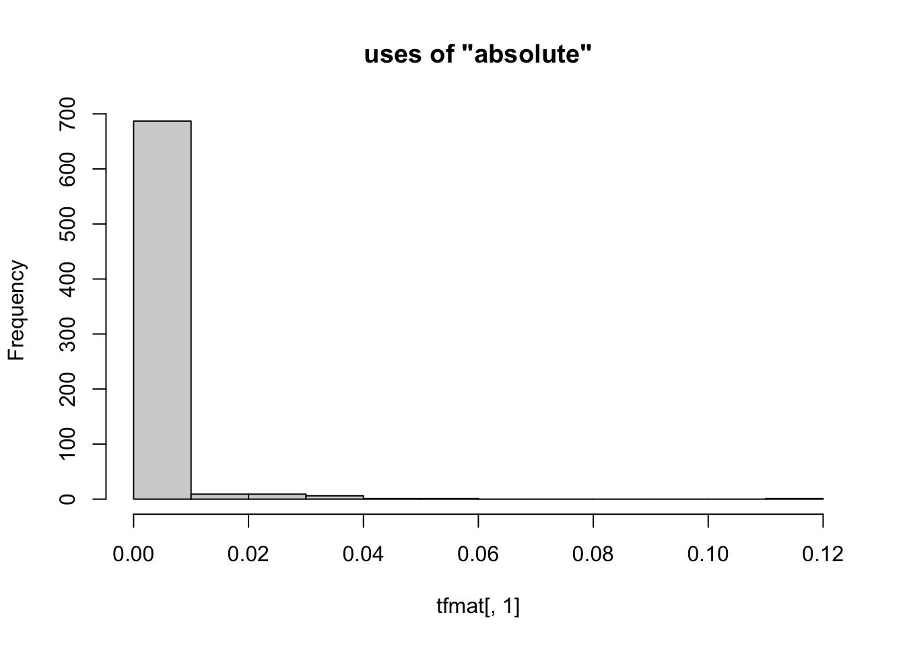
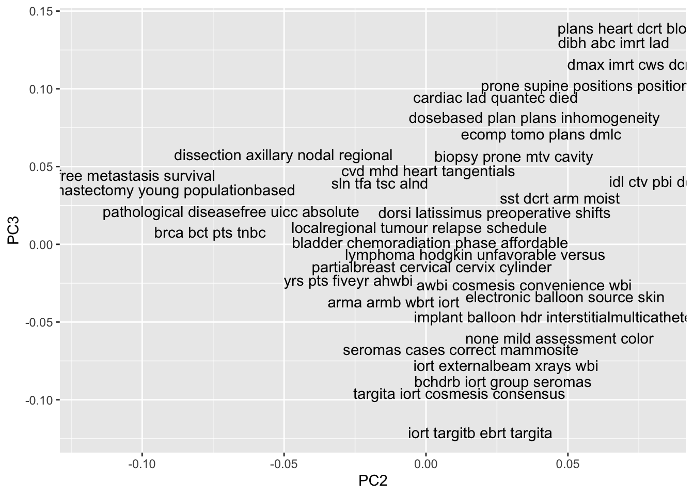

# Exploratory data analysis
Having now imported the data as a TF-IDF matrix, we aree able to begin with some exploratory data analysis. The analysis can help us to understand patterns in the big stack of abstracts about breast cancer. It won't tell us much about any particular one of the abstracts - remember that we've reduced each one to a vector of term frequencies so as a text document each abstract has been stripped of meaning. But we are going to be able to identify large-scale patterns in the collection of abstracts much more quickly than if we had to read each one.

## Principal components analysis
Principal components analysis, which will be abbreviated PCA, is a method used in exploratory data analysis for multidimensional data. That's what we're working with, since the 8180 columns of the TF-IDF matrix are more than we could possibly explore on a column-by-column basis.

### Check the TF-IDF matrix
Not only are there too many columns to work through individually, but also each column is mostly zeroes. As a result an individual column of the TF-IDF matrix doesn't contain much information. This makes sense if you consider consider how much you would learn about books published in 2020 by counting the number of times each one used ther word "whale". Here's an example. 


```r
# first, convert the TF-IDF to a dense matrix
tfmat = as.matrix( tfidf_dtm )

# identify the first term and plot its histogram
hist( tfmat[, 1], main=paste0( 'uses of "', colnames( tfmat )[[1]], '"' ))
```



```r
# identify the second term and plot its histgram
hist( tfmat[, 2], main=paste0( 'uses of "', colnames( tfmat )[[2]], '"' ))
```


```r
# plot the first two columns 
plot( as.matrix(tfidf_dtm[, 1:2]), bty='n', main=paste0( 'joint uses of "',
  colnames( tfmat )[[1]], '" and "', colnames( tfmat )[[2]], '"') )
```


### Compute PCA 
Since the individual columns don't convey much information, PCA rotates the big matrix until we are "looking" down the "direction" (or component) with the most variability. The result is another matrix of equal size to the first, but each column contains information from all of the columns of the original matrix, and they are sorted so that the columns with the most variability are first. This will take your computer several seconds to calculate.


```r
# rotate the TF-IDF so the columns are articles
articles = t( tfmat )

# calculate PCA on the rotated TF-IDF
pca = prcomp(articles, center=TRUE, scale=TRUE)

# extract the matrix of rotations
pcmat = as.data.frame( pca$rotation )
```

### Plot the abstracts
We can now look at a plot of the first two principal components to see how it contains more information than the first columns of the TF-IDF matrix.


```r
# plot the first two principal components
with( pcmat, plot(PC1, PC2) )
```


Unlike the TF-IDF, the x and y axes here have no inherent meaning, but they are aligned with the greatest variability in the data. So by inspecting the articles that are at the extremes, we can begin to understand the strongest signals that PCA detected in the articles.

### Examine how principal components sort the documents


```r
# identify the order of documents along the first principal component
indx <- order( pcmat$PC1 )

# view the titles at the extremes of the first principal component
data$title[ head(indx) ]
```

```
## [1] "Signal transduction pathways regulated by CSF-1 receptors modulate the in vitro radiosensitivity of mammary epithelial cells."                                                                                                                           
## [2] "Creation of an episode-based payment model for prostate and breast cancer radiation therapy."                                                                                                                                                            
## [3] "Erratum to: Wang SY, Kelly G, Gross C, et al. Information needs of older women with early-stage breast cancer when making radiation therapy decisions. [Int J Radiat Oncol Biol Phys 2017;98:733-740](S0360301617303097)(10.1016/j.ijrobp.2017.02.001))."
## [4] "Molecular radiation therapy in experimental model of advanced prostate cancer using internalizable monoclonal antibody."                                                                                                                                 
## [5] "Dna double-strand break repair and induction of apoptosis in relation to late normal tissue responses following radiation therapy for early breast cancer."                                                                                              
## [6] "Patient experience survey of early-stage breast cancer patients undergoing whole-breast radiation therapy."
```

```r
data$title[ tail(indx) ]
```

```
## [1] "Phase I/II Study Evaluating Early Tolerance in Breast Cancer Patients Undergoing Accelerated Partial Breast Irradiation Treated With the MammoSite Balloon Breast Brachytherapy Catheter Using a 2-Day Dose Schedule."                          
## [2] "Accelerated partial breast irradiation using sole interstitial multicatheter brachytherapy versus whole breast irradiation for early breast cancer: Five-year results of a randomized phase 3 trial-Part I: Local control and survival results."
## [3] "Accelerated partial-breast irradiation provides equivalent 10-year outcomes to whole breast irradiation: A matched-pair analysis."                                                                                                              
## [4] "Daily Fractionation of External Beam Accelerated Partial Breast Irradiation to 40 Gy Is Well Tolerated and Locally Effective."                                                                                                                  
## [5] "Margin status an indication for accelerated partial breast irradiation in early-stage breast cancers."                                                                                                                                          
## [6] "Differences in Patterns of Failure in Patients Treated With Accelerated Partial Breast Irradiation Versus Whole-Breast Irradiation: A Matched-Pair Analysis With 10-Year Follow-Up."
```

It seems that the PCA has detected a pattern in term usage that distinguishes between papers on one extreme that make comparisons between whole- and partial-breast radiation therapy, and papers on the other extreme that are mostly about molecular biology. This is kind of impressive when you consider that the computer did it without any human input about what language might be relevant to medicine or biology. Let's look at how some other principal components are separating the documents.


```r
# identify the order of documents along the second principal component
indx = order( pcmat$PC2 )

# observe which papers are at the extremes of the second PC
data$title[ head(indx) ]
```

```
## [1] "The influence of young age on outcome in early stage breast cancer."                                                                                                      
## [2] "Locoregional failure in early-stage breast cancer patients treated with breast-conserving therapy: Which patients benefit from supraclavicular nodal irradiation?"        
## [3] "Breast conservation treatment of early stage breast cancer: Patterns of failure."                                                                                         
## [4] "Equivalent survival with breast conservation therapy or mastectomy in the management of youngwomen with early-stage breast cancer."                                       
## [5] "Delivering adjuvant radiation therapy beyond 6 months after breast-conserving surgery does not jeopardize the locoregional control in early-stage breast cancer patients."
## [6] "Profile of prognostic factors in 1022 Indian women with early-stage breast cancer treated with breast-conserving therapy."
```

```r
data$title[ tail(indx) ]
```

```
## [1] "Hypofractionated whole breast radiation therapy: Does size matter?"                                                                                                                                    
## [2] "Comparison of preoperative partial breast radiosurgery treatment techniques: 3D-CRT, non-coplanar IMRT, coplanar IMRT, and VMAT."                                                                      
## [3] "A dosimetric planning study for hypofractionated whole breast irradiation with concurrent boost (RTOG 1005) for early stage breast cancer."                                                            
## [4] "Prone hypofractionated whole-breast radiotherapy without a boost to the tumor bed: Comparable toxicity of IMRT versus a 3D conformal technique."                                                       
## [5] "Ongoing clinical experience utilizing 3D conformal external beam radiotherapy to deliver partial-breast irradiation in patients with early-stage breast cancer treated with breast-conserving therapy."
## [6] "Prone accelerated partial breast irradiation after breast-conserving surgery: Preliminary clinical results and dose-volume histogram analysis."
```

With the second principal component, we see a separation between papers about breast-conserving therapy at one extreme and papers about hypofractionated, conformal, or modulated radiation therapy at the other extreme.


```r
# identify the order of documents along the third principal component
indx = order( pcmat$PC3 )

# observe which papers are at the extremes of the second PC
data$title[ head(indx) ]
```

```
## [1] "External beam radiation therapy versus intraoperative radiation therapy for breast-conserving therapy: A large single-institution matched-pair evaluation."           
## [2] "Early results of a prospective cohort study on intraoperative radiation therapy for early breast cancer at a single institution."                                     
## [3] "Cosmetic outcome and late breast toxicity after intraoperative radiation therapy as a single modality or as a boost using the intrabeam® device: A prospective study."
## [4] "Updated results of a prospective cohort study on intraoperative radiation therapy for early breast cancer at a single-institution."                                   
## [5] "First safety analysis after 80 treated patients with early breast cancer within the targit-e trial."                                                                  
## [6] "A comparison of the early toxicities of balloon catheter high-dose-rate brachytherapy (BCHDRB) and intraoperative radiation therapy."
```

```r
data$title[ tail(indx) ]
```

```
## [1] "Dosimetric comparison of radiotherapy for left sided breast cancer: Breath-hold versus free breathing."                                                                                                 
## [2] "Is there justification for the utilization of IMRT in the treatment of early-stage right breast cancer?"                                                                                                
## [3] "Bilateral breast and regional nodal irradiation in early stage breast cancer D a dosimetric comparison of IMRT and 3D conformal radiation therapy."                                                     
## [4] "Small arc volumetric modulated arc therapy: A new approach superior to IMRT in optimizing dosimetric and treatment relevant parameters for patients following breast conservative surgery."             
## [5] "Comparison of different radiation techniques to achieve normal tissue sparing and target volume coverage in the treatment of left-sided early stage breast cancer."                                     
## [6] "Planning comparison of intensity modulated radiation therapy delivered with 2 tangential fields versus 3-dimensional conformal radiotherapy for cardiac sparing in women with left-sided breast cancer."
```

At one extreme of the third principal component are articles about intraoperative radiation therapy and at the other extreme are articles about radiation dosimetry, especially with respect to modulated and conformal radiation therapy.

### Interpreting PCA
It looks like there are patterns of actual meaning arising from the PCA. We're not talking here about statistical significance or clinical importance. It is still for humans to decide what patterns have clinical importance. Here, PCA is a shortcut that allows us to identify some patterns in articles about breast cancer radiation therapy without having to read all of the articles. All of the patterns I've cited are based on patterns of word usage, and yet it appears that those patterns in word usage actually map onto distinctions with real-world meaning. So keep in mind that the principal components are only identifying patterns in term frequencies but the PCA is useful only when those terms map onto real-world meaning.

So far, we've looked at the most extreme documents along some principal components. If you want to see more than a few documents at a time, or see how documents align jointly on two principal components, then you want to do a scatterplot of the top terms of each document. I'll show you how, but it uses a function called `top_terms()` that needs to be loaded from our Github repository (it's too complex to live-code).


```r
# load the function for identifying top terms in documents
source(url("https://ucdavisdatalab.github.io/workshop-nlp-healthcare/top_terms.R"))

# cbind data and the PCA rotation
plotdata <- cbind(data, pcmat)

# identify top terms for each document and attach them to the plotdata
plotdata[[ 'top_terms' ]] <- top_terms( tfidf_dtm )

# visualize the top principal components in terms of top terms
ggplot(plotdata) + aes(x=PC2, y=PC3, label=top_terms) + geom_text(check_overlap=TRUE)
```



We've seen the patterns that align with the first, second, and third principal components. What makes these principal components the first, second, and third? The PCs are ranked by the amount of total variance in the TF-IDF matrix that they explain. So the first principal component is aligned with the strongest signal in term frequency, and the second is aligned with the strongest signal that's left over after accounting for the first component, and so on. The strength of signal is quantified by the proportion of variance in the TF-IDF matrix that is explained by each principal component. In order to see how the strength of signal changes along the sequence of PCs, we can visualize the cumulative percent of variance explained.


```r
plot(100 * cumsum(pca$sdev^2) / sum(pca$sdev^2), type='l', bty='n',
    ylab="% total variance explained", xlab="Number of components")
```


