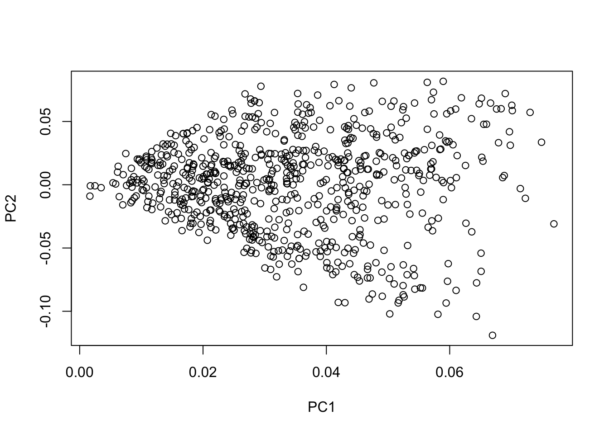
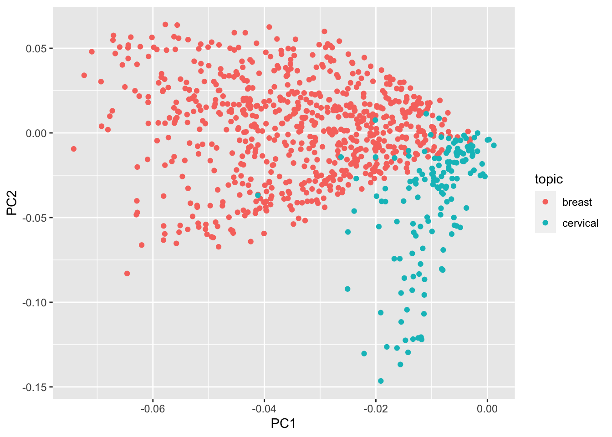
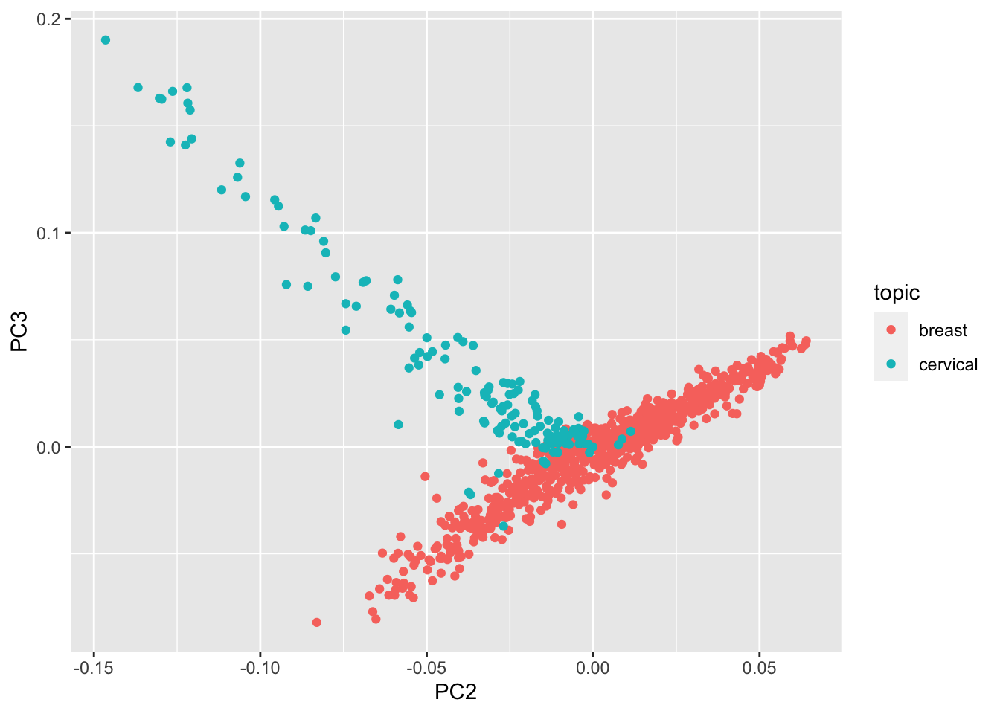
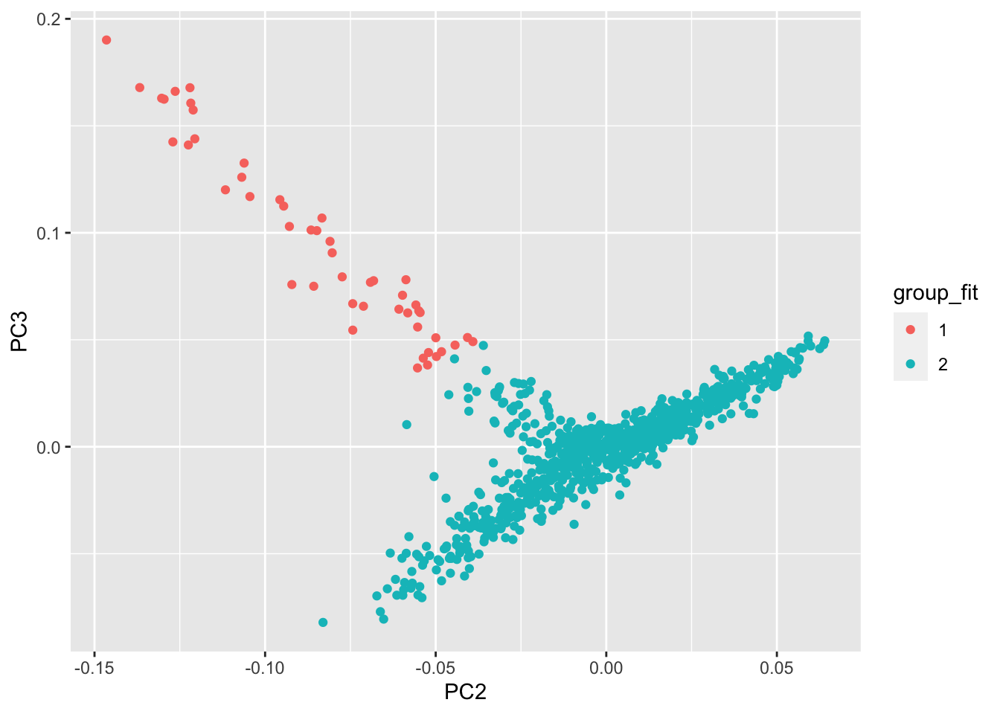

# PCA

#### a. Intuition behind PCA
The most straightforward way to visualize the information in the TF-IDF matrix is to plot its columns, but this is unsatisfactory because there are thousands of them, and each column is mostly zeroes (so contains little information):


```r
plot(as.matrix(tfidf_dtm[, 1:2]))
```



Our answer is to use principal components analysis (PCA), which rotates the big matrix until we are "looking" down the "direction" (or component) with the most variability. The result is another matrix of equal size to the first, but each column contains information from all of the columns of the original matrix, and they are sorted so that the most important columns are first. We can observe get the most important relationships by focusing on just a few of these "principal components". Let's continue with our example:

#### b. Computing PCA 


```r
articles <- t(tfidf_dtm)
mypca <- prcomp(articles, center=TRUE, scale=TRUE)
```

#### c. Plotting the abstracts

Add the principal components to the original data:


```r
plotdata <- cbind(data, mypca$rotation)
```

And now plot the abstracts. Each dot in the figure represents one abstract.


```r
ggplot(plotdata) + aes(x=PC1, y=PC2) + geom_point()
```


Now let's identify some articles from the plot. 


```r
min_index <- order(plotdata$PC1, decreasing=FALSE)
max_index <- order(plotdata$PC1, decreasing=TRUE)

# view the most divergent titles:
plotdata$title[min_index[1:6]]
```

```
## [1] "Signal transduction pathways regulated by CSF-1 receptors modulate the in vitro radiosensitivity of mammary epithelial cells."                                                                                                                           
## [2] "Creation of an episode-based payment model for prostate and breast cancer radiation therapy."                                                                                                                                                            
## [3] "Erratum to: Wang SY, Kelly G, Gross C, et al. Information needs of older women with early-stage breast cancer when making radiation therapy decisions. [Int J Radiat Oncol Biol Phys 2017;98:733-740](S0360301617303097)(10.1016/j.ijrobp.2017.02.001))."
## [4] "Molecular radiation therapy in experimental model of advanced prostate cancer using internalizable monoclonal antibody."                                                                                                                                 
## [5] "Dna double-strand break repair and induction of apoptosis in relation to late normal tissue responses following radiation therapy for early breast cancer."                                                                                              
## [6] "Patient experience survey of early-stage breast cancer patients undergoing whole-breast radiation therapy."
```

```r
plotdata$title[max_index[1:6]]
```

```
## [1] "Differences in Patterns of Failure in Patients Treated With Accelerated Partial Breast Irradiation Versus Whole-Breast Irradiation: A Matched-Pair Analysis With 10-Year Follow-Up."                                                            
## [2] "Margin status an indication for accelerated partial breast irradiation in early-stage breast cancers."                                                                                                                                          
## [3] "Daily Fractionation of External Beam Accelerated Partial Breast Irradiation to 40 Gy Is Well Tolerated and Locally Effective."                                                                                                                  
## [4] "Accelerated partial-breast irradiation provides equivalent 10-year outcomes to whole breast irradiation: A matched-pair analysis."                                                                                                              
## [5] "Accelerated partial breast irradiation using sole interstitial multicatheter brachytherapy versus whole breast irradiation for early breast cancer: Five-year results of a randomized phase 3 trial-Part I: Local control and survival results."
## [6] "Phase I/II Study Evaluating Early Tolerance in Breast Cancer Patients Undergoing Accelerated Partial Breast Irradiation Treated With the MammoSite Balloon Breast Brachytherapy Catheter Using a 2-Day Dose Schedule."
```

Visualize the explained variance. This is the metric that PCA uses to decide which components are the most important.


```r
plot(100 * cumsum(mypca$sdev^2) / sum(mypca$sdev^2), type='l', bty='n', ylab="% total variance explained", xlab="Number of components")
```


Let's add some additional information: a few top terms from each abstract. These are the most characeristic terms from the abstract, as ranked by TF-IDF. We'll plot the abstracts on the 2nd and 3rd principal components, annotated by the top terms.


```r
#source(url("https://ucdavisdatalab.github.io/workshop-nlp-healthcare/top_terms.R"))
plotdata[['top_terms']] <- top_terms(tfidf_dtm)
ggplot(plotdata) + aes(x=PC2, y=PC3, label=top_terms) + geom_text(check_overlap=TRUE)
```


We're also going to look at k-means to identify clusters in data. To begin, let's include some abstracts dealing with cervical cancer from the same journals as the breast cancer abstracts.


```r
cervical <- read.csv(url("https://ucdavisdatalab.github.io/workshop-nlp-healthcare/cervical-abstracts.csv"))
data[["topic"]] <- "breast"
cervical[["topic"]] <- "cervical"
combined <- rbind(data, cervical)
```

Rather than processing the combined abstracts step-by-step, let's grab a function to replicate the processing we did on the breast cancer abstracts. This time, though, the terms "breast" "cervical", and "cervix" will be removed prior to the analysis.


```r
#source(url("https://ucdavisdatalab.github.io/workshop-nlp-healthcare/get_corpus.R"))
pca_combined <- get_corpus(combined, remove=c("cervical", "cervix", "breast"))
data_combined <- cbind(combined, pca_combined$rotation)
```

We now have a PCA of the combined abstracts, so let's see how the first few components look:


```r
ggplot(data_combined) + aes(x=PC1, y=PC2, color=topic) + geom_point()
```



```r
ggplot(data_combined) + aes(x=PC2, y=PC3, color=topic) + geom_point()
```



If we didn't know the correct labels, we can let the computer pick them itself. One commonly-used method that's built into R is k-means classification. K-means identifies clusters in data based on maximizing the similarity within groups while maximizing the dissimilarity between groups. It is often best to use PCA for dimension-reduction before applying PCA because separation between points increases with the square of the number of dimensions, and that separation makes clustering less effective. Here I will be quite aggressive and use only three principal components.


```r
km <- kmeans(pca_combined$rotation[, 1:3], 2, iter.max=1e3, nstart=100)
km_fit <- fitted(km, method="classes")
data_combined[["group_fit"]] <- as.factor(km_fit)

ggplot(data_combined) + aes(x=PC2, y=PC3, color=group_fit) + geom_point()
```



Another way to explore the result of k-means is to look at the articles that are most characteristic of each cluster. First, calculate the sum of squared residuals for each article.


```r
km_residual <- pca_combined$rotation[, 1:3] - fitted(km)
km_ss_residual <- apply(km_residual, 1, var)
data_combined[["err"]] <- km_ss_residual
```

Now we can identify the articles within each group that have the smallest residuals. These are closest to the group center, and thus most characteristic of the group.


```r
data_ordered <- data_combined[order(data_combined[["err"]]),]
head(data_ordered[["title"]][data_ordered[["group_fit"]] == 1])
```

```
## [1] "Analysis of the Financial Impact of the 2018 ASTRO Breast Dose-Fractionation Guidelines on Radiation Oncology Departmental Reimbursement."                   
## [2] "Patterns of breast recurrence in a pilot study of brachytherapy confined to the lumpectomy site for early breast cancer with six years' minimum follow-up."  
## [3] "Long-term radiation complications following conservative surgery (CS) and radiation therapy (RT) in patients with early stage breast cancer."                
## [4] "Treatment-related toxicity from a randomized trial of the sequencing of doxorubicin and radiation therapy in patients treated for early stage breast cancer."
## [5] "Local recurrence and survival for the german centers in the targit-a (targeted intraoperative radiation therapy-alone) trial."                               
## [6] "Sphere of Equivalence-A Novel Target Volume Concept for Intraoperative Radiotherapy Using Low-Energy X Rays."
```

```r
head(data_ordered[["title"]][data_ordered[["group_fit"]] == 2])
```

```
## [1] "Screening for wart virus infection in normal and abnormal cervices by DNA hybridisation of cervical scrapes."                                                  
## [2] "Viral load of human papillomavirus and risk of CIN3 or cervical cancer."                                                                                       
## [3] "Progressive potential of mild cervical atypia: prospective cytological, colposcopic, and virological study."                                                   
## [4] "Relation between human papillomavirus type 16 and potential for progression of minor-grade cervical disease."                                                  
## [5] "HPV 16 DNA in normal and malignant cervical epithelium: implications for the aetiology and behaviour of cervical neoplasia."                                   
## [6] "Final efficacy, immunogenicity, and safety analyses of a nine-valent human papillomavirus vaccine in women aged 16-26 years: a randomised, double-blind trial."
```
