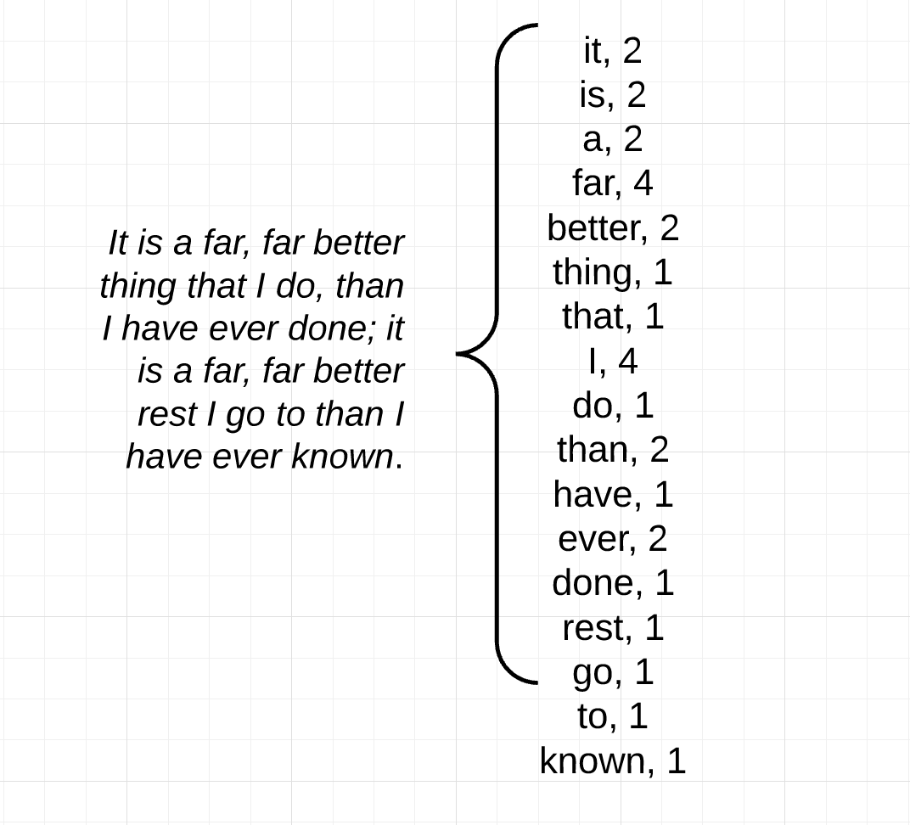

# Setup

link to lesson plan: [https://ucdavisdatalab.github.io/workshop-nlp-healthcare/](https://ucdavisdatalab.github.io/workshop-nlp-healthcare/)

#### a. objectives
``` {objective}
1. Show how to store and clean text data with the 'tm' package
2. Introduce Bag of Words representation of documents
3. Demonstrate how to create and use a DocumentTermMatrix
4. Explain and demonstrate TF-IDF weighting 
5. Explain PCA and its applications for corpus exploration
```

#### b. packages needed

In R, and most programming languages, there are many packages - code written by other people to help with certain tasks. 
For this workshop we will be using two packages - 'tm' and 'ggplot2'.
The 'tm' - text mining - package has methods for mining text with R including importing data, storing corpora, applying operations on corpora (such as common preprocessing methods), and document term matrices.
The 'ggplot2' package has functions related to plotting and visualizing data.


Run this command if you don't already have these packages installed.
```{r, eval=FALSE}
install.packages('tm')
install.packages('ggplot2')
install.packages('Matrix')
```

Once the packages are installed, load them into your R environment.
```{r, message=FALSE}
library('tm')
library('ggplot2')
library('Matrix')
```

You can find the documentation for the package [online](https://cran.r-project.org/web/packages/tm/tm.pdf)\
Within R/RStudio you can browse function documentation with the following syntax.
```
?TermDocumentMatrix
```

#### c. data for this workshop

For this workshop, we are looking at a set of abstracts of medical journal articles related to breast cancer.
We have 714 abstracts, stored in a csv, with duplicates. 
We would like to get the key words from each abstract, as well as visualize / check for groupings of abstracts in two dimensions.\


```{r}
data <- read.csv(url("https://ucdavisdatalab.github.io/workshop-nlp-healthcare/abstracts.csv"))
```

```{r}
head(data)
```
We have a dataframe with 714 rows, each row referring to a different abstract. 
For each abstract we have the authors, year published, title of the paper, name of the journal, and the full text.

Let's look at the text from the first abstract
```{r}
data$text[[1]]
```
Notice that within the text there are a variety of potential issues. 
For example, some words are capitalized, there is punctuation, weird symbols, and numbers. 
For many NLP methods, we want to normalize the texts to get around these issues. 
The 'tm' package has several built in features for normalizing text. 
The first step is to load the text into a 'corpus' object.


# Preprocessing

#### a. Load the text column into a 'corpus' object
```{r}
mycorpus <- Corpus(VectorSource(data$text))
inspect(head(mycorpus))
```

#### b.  Preprocess the corpus object
Use the tm_map function to apply a transformation on each element of the corpus object.  
Alternatively use the tm_parLapply function to do the same in parallel.
```{r, warning=FALSE}
mycorpus <- tm_map(mycorpus, tolower)
mycorpus <- tm_map(mycorpus, removePunctuation, ucp=TRUE)
mycorpus <- tm_map(mycorpus, removeNumbers)
mycorpus <- tm_map(mycorpus, removeWords, stopwords("en")) 
```

Now that we have normalized the text, lets look at the first abstract again.
```{r}
mycorpus[[1]]$content
```

It looks 'normalized' but how do we model this? how do we apply NLP algorithms on it?

# The Bag of Words Representation

Consider: \
what is a text document to a computer?  \
What can it do with a sequence of characters? \  

In order for us to apply statistical methods on a document, we need a representation of texts that is easy for a computer to process, but still encodes information related to that text's content.
One such representation is the Bag of Words format.\

Bag of Words is a way of representing a document that encodes a document as a 'bag' of its tokens.
The document is represented as the words that appeared in the document and the number of times those words appeared.
All information about word order is lost in this representation, however, for many NLP methods, this is still an effective representation of the content of the document.\



The power of the bag of words representation is that each document can be represented in the same vector space.
We do so by defining the vector dimensions to reflect the vocabulary across all the documents.
The vectors can then be merged into a matrix called a Document Term Matrix.


# The Document Term Matrix

In brief, a Document Term Matrix:  
  - each document is represented by a set of tokens and their counts  
  - the order of tokens is not encoded in this representation  
  - the basis of many text processing methods, including document classification and topic modeling  

In R we can use a DocumentTermMatrix function from the 'tm' package to create this structure from our corpus.  

#### a. Creating a Document Term Matrix from the corpus object    
From the 'corpus' object we can create a document term matrix.
```{r}
mydtm <- DocumentTermMatrix(mycorpus)
```
Note: the DocumentTermMatrix automatically sets all the characters to lower case.

#### b. Exploring with a DTM  

A useful tool is the inspect function from the 'tm' package.
```{r}
inspect(mydtm)
```

From this format it we can find word counts and document lengths.
```{r}
document_lengths <- rowSums(as.matrix(mydtm))
word_counts <- colSums(as.matrix(mydtm))
```

We can get a sorted list of the biggest documents.
```{r}
sorted_document_lengths <- sort(document_lengths, decreasing=TRUE)
barplot(sorted_document_lengths[1:10], col = "tan", las = 2)
```
Or a sorted list of words and their frequencies.
```{r}
sorted_word_counts <- sort(word_counts, decreasing=TRUE)
barplot(sorted_word_counts[1:10], col = "tan", las = 2)
```

# TF-IDF

TF-IDF stands for term frequency-inverse document frequency. 
It is a VERY popular method for finding documents relevant to a users search term. 
It can also be used as an effective (often times better than simple bag of words) representation of documents for statistical modeling of documents in a corpus. 

#### a. Intuition behind TF-IDF

TF-IDF combines two attributes that may signal a words importance in a document into a single metric. 
The first is the 'term frequency (TF)' - how often the word appeared within that document. 
It makes intuitive sense that if a word appears many times in a document, that the document is about something related to that term.
The second attribute is the 'inverse document frequency (IDF)' - a measure of what proportion of the documents the word appeared in. If a word appears in all documents, its weight should be reduced. 
Conversely, if a word appears only in few documents, it should be highly weighted for those documents. 

#### b. TF-IDF formula

```
tfidf(t,d,D) = tf(t,d) * idf(t,D)
```
Where, tf(t,d) is a function of a terms(t) frequency for a given document(d). 
And, idf(t,D) is the inverse function of a terms(t) appearance across all the documents(D).  There are many variations of functions for tf(t,d) and idf(t,D) that can be used for computing TF-IDF.  


#### c. TF-IDF from DTM
Create tf-idf weighted DTM in R
```{r}
tfidf_dtm <- weightTfIdf(mydtm, normalize=TRUE) 
```

#### d. Looking at the results
Inspect the new dtm
```{r}
inspect(tfidf_dtm)
```

Compare the tfidf representation with the tf representation for a single abstract
```{r}
tf_doc10 <- as.matrix(mydtm[10,])
tf <- colSums(tf_doc10)
tfidf_doc10 <- as.matrix(tfidf_dtm[10,])
tfidf <- colSums(tfidf_doc10)
barplot(sort(tf, decreasing=TRUE)[1:10], col = "tan", las = 2)
barplot(sort(tfidf, decreasing=TRUE)[1:10], col = "tan", las = 2)
```

# PCA

#### a. Intuition behind PCA
The most straightforward way to visualize the information in the TF-IDF matrix is to plot its columns, but this is unsatisfactory because there are thousands of them, and each column is mostly zeroes (so contains little information):

```{r}
plot(as.matrix(tfidf_dtm[, 1:2]))
```

Our answer is to use principal components analysis (PCA), which rotates the big matrix until we are "looking" down the "direction" (or component) with the most variability. The result is another matrix of equal size to the first, but each column contains information from all of the columns of the original matrix, and they are sorted so that the most important columns are first. We can observe get the most important relationships by focusing on just a few of these "principal components". Let's continue with our example:

#### b. Computing PCA 

```{r}
articles <- t(tfidf_dtm)
mypca <- prcomp(articles, center=TRUE, scale=TRUE)
```

#### c. Plotting the abstracts

Add the principal components to the original data:

```{r}
plotdata <- cbind(data, mypca$rotation)
```

And now plot the abstracts. Each dot in the figure represents one abstract.

```{r}
ggplot(plotdata) + aes(x=PC1, y=PC2) + geom_point()
```

Now let's identify some articles from the plot. 

```{r}
min_index <- order(plotdata$PC1, decreasing=FALSE)
max_index <- order(plotdata$PC1, decreasing=TRUE)

# view the most divergent titles:
plotdata$title[min_index[1:6]]
plotdata$title[max_index[1:6]]
```

Visualize the explained variance. This is the metric that PCA uses to decide which components are the most important.

```{r}
plot(100 * cumsum(mypca$sdev^2) / sum(mypca$sdev^2), type='l', bty='n', ylab="% total variance explained", xlab="Number of components")
```

Let's add some additional information: a few top terms from each abstract. These are the most characeristic terms from the abstract, as ranked by TF-IDF. We'll plot the abstracts on the 2nd and 3rd principal components, annotated by the top terms.

```{r}
source(url("https://ucdavisdatalab.github.io/workshop-nlp-healthcare/top_terms.R"))
plotdata[['top_terms']] <- top_terms(tfidf_dtm)
ggplot(plotdata) + aes(x=PC2, y=PC3, label=top_terms) + geom_text(check_overlap=TRUE)
```

We're also going to look at k-means to identify clusters in data. To begin, let's include some abstracts dealing with cervical cancer from the same journals as the breast cancer abstracts.

```{r import-cervical-abstracts}
cervical <- read.csv(url("https://ucdavisdatalab.github.io/workshop-nlp-healthcare/cervical-abstracts.csv"))
data[["topic"]] <- "breast"
cervical[["topic"]] <- "cervical"
combined <- rbind(data, cervical)
```

Rather than processing the combined abstracts step-by-step, let's grab a function to replicate the processing we did on the breast cancer abstracts. This time, though, the terms "breast" "cervical", and "cervix" will be removed prior to the analysis.

```{r, warning=FALSE}
source(url("https://ucdavisdatalab.github.io/workshop-nlp-healthcare/get_corpus.R"))
pca_combined <- get_corpus(combined, remove=c("cervical", "cervix", "breast"))
data_combined <- cbind(combined, pca_combined$rotation)
```

We now have a PCA of the combined abstracts, so let's see how the first few components look:

```{r}
ggplot(data_combined) + aes(x=PC1, y=PC2, color=topic) + geom_point()
ggplot(data_combined) + aes(x=PC2, y=PC3, color=topic) + geom_point()
```

If we didn't know the correct labels, we can let the computer pick them itself. One commonly-used method that's built into R is k-means classification. K-means identifies clusters in data based on maximizing the similarity within groups while maximizing the dissimilarity between groups. It is often best to use PCA for dimension-reduction before applying PCA because separation between points increases with the square of the number of dimensions, and that separation makes clustering less effective. Here I will be quite aggressive and use only three principal components.

```{r k-means}
km <- kmeans(pca_combined$rotation[, 1:3], 2, iter.max=1e3, nstart=100)
km_fit <- fitted(km, method="classes")
data_combined[["group_fit"]] <- as.factor(km_fit)

ggplot(data_combined) + aes(x=PC2, y=PC3, color=group_fit) + geom_point()
```

Another way to explore the result of k-means is to look at the articles that are most characteristic of each cluster. First, calculate the sum of squared residuals for each article.

```{r}
km_residual <- pca_combined$rotation[, 1:3] - fitted(km)
km_ss_residual <- apply(km_residual, 1, var)
data_combined[["err"]] <- km_ss_residual
```

Now we can identify the articles within each group that have the smallest residuals. These are closest to the group center, and thus most characteristic of the group.

```{r}
data_ordered <- data_combined[order(data_combined[["err"]]),]
head(data_ordered[["title"]][data_ordered[["group_fit"]] == 1])
head(data_ordered[["title"]][data_ordered[["group_fit"]] == 2])
```


