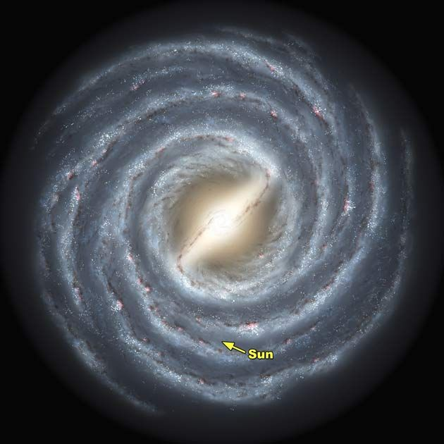

download data here:\
[abstracts-datafied.csv](workshop-nlp-healthcare/abstracts-datafied.csv)

# Objectives for Workshop
``` {objective}
1. Introduce Natural Language Processing 
2. Introduce the 'tm' package in R 
3. Explain ways of representing documents so they can be analyzed with computational methods
4. Demonstrate usage of the corpus and DocumentTermMatrix objects
5. Explain and demonstrate TF-IDF weighting 
6. Explain PCA and its applications for corpus exploration
```

# Presentation of the data

For this workshop, we are looking at a set of abstracts of medical journal articles related to breast cancer.
We have X abstracts, stored in a csv, with duplicates. 
We would like to get the key words from each abstract, as well as visualize / check for groupings of abstracts in two dimensions.

# The tm package

The 'tm' - text mining - package has methods for mining text with R including importing data, storing corpora, applying operations on corpora (such as common preprocessing methods), and document term matrices.

#### a. install + load the 'tm' package
```{r}
#install.packages(c('tm', 'readr', 'ggplot2'))
library('tm')
library('readr')
library('ggplot2')
```
#### b. package help
You can find the documentation for the package [online](https://cran.r-project.org/web/packages/tm/tm.pdf)\
Within R/RStudio you can browse function documentation
```
?TermDocumentMatrix
```

# Loading Text into R - the corpus object

#### a.  Create a 'Corpus' object using the 'tm' package
The first step is to load the text data into a 'corpus' object.
```{r}
data <- read_csv(url("https://raw.githubusercontent.com/ucdavisdatalab/workshop-nlp-healthcare/master/data/abstracts-datafied.csv"))
mycorpus = Corpus(VectorSource(data$text))
```

#### b.  Preprocess the corpus object
Use the tm_map function to apply a transformation on each element of the corpus object.  
Alternatively use the tm_parLapply function to do the same in parallel.
```{r}
mycorpus = tm_map(mycorpus, removePunctuation, ucp=TRUE)
mycorpus = tm_map(mycorpus, removeNumbers)
mycorpus = tm_map(mycorpus, tolower)
mycorpus = tm_map(mycorpus, removeWords, stopwords("en")) # may need snowballC package

tm_map(mycorpus, removeWords, c("breast", "cervical", "cervix", "prostate"))
```
# The Document Term Matrix 

Consider: \
what is a text document to a computer?  \
What can it do with a sequence of characters? \  

In order for us to apply statistical methods on a document, we need a representation of texts that is easy for a computer to process, but still encodes information related to that text's content.
One such representation is the Bag of Words format.\

Bag of Words is a way of representing a document that encodes a document as a 'bag' of its tokens.
The document is represented as the words that appeared in the document and the number of times those words appeared.
All information about word order is lost in this representation, however, for many NLP methods, this is still an effective representation of the content of the document.\

In R we can use a Document Term Matrix.  

In brief, a Document Term Matrix:  
  - each document is represented by a set of tokens and their counts  
  - the order of tokens is not encoded in this representation  
  - the basis of many text processing methods, including document classification and topic modeling  

#### a. Creating a Document Term Matrix from the corpus object    
From the 'corpus' object we can create a document term matrix.
```{r}
mydtm = DocumentTermMatrix(mycorpus)
mydtm 
```
Note: the DocumentTermMatrix automatically sets all the characters to lower case.

#### b. Exploring with a DTM  
DocumentTermMatrices are stored as Simple Triplet Matrices.  
Simple Triplet Matrices are a way of storing sparse matrices.  
Be aware of this when probing the object.  
```{r}
class(mydtm)
str(mydtm)
```

A useful tool is the inspect function from the 'tm' package.
```{r}
inspect(mydtm)
```

Use the 'slam' package to perform common operations on the DTM in simple triplet matrix form
```{r}
#install.packages("slam")
library(slam)
myrowsums = row_sums(mydtm)
mycolsums = col_sums(mydtm)
myrowmeans = row_means(mydtm)
mycolmeans = col_means(mydtm)
```

For small dtms, as is the case with our workshop data, we can convert to a non sparse matrix format.  
This may be easier to work with.
```{r}
mydtm_mat = as.matrix(mydtm)
```

Examples:  
We want to get rid of all the empty documents from the document term matrix.
```{r}
mydtm = mydtm[rowSums(mydtm_mat) > 0,]
```
Get rid of duplicates
```{r}
#mydtm = unique(mydtm)
```
Sort the documents by number of tokens
```{r}
doccounts = order(rowSums(mydtm_mat), decreasing=TRUE)
```
Similarly find the most common words
```{r}
wordfreqs = order(colSums(mydtm_mat), decreasing=TRUE)
``` 
# TF-IDF

TF-IDF stands for term frequency-inverse document frequency. 
It is a VERY popular method for finding documents relevant to a users search term. 
It can also be used as an effective (often times better than simple bag of words) representation of documents for statistical modeling of documents in a corpus. 

#### a. Intuition behind TF-IDF

TF-IDF combines two attributes that may signal a words importance in a document into a single metric. 
The first is the 'term frequency (TF)' - how often the word appeared within that document. 
It makes intuitive sense that if a word appears many times in a document, that the document is about something related to that term.
The second attribute is the 'inverse document frequency (IDF)' - a measure of what proportion of the documents the word appeared in. If a word appears in all documents, its weight should be reduced. 
Conversely, if a word appears only in few documents, it should be highly weighted for those documents. 

#### b. TF-IDF formula

```
tfidf(t,d,D) = tf(t,d) * idf(t,D)
```
Where, tf(t,d) is a function of a terms(t) frequency for a given document(d). 
And, idf(t,D) is the inverse function of a terms(t) appearance across all the documents(D).
There are many variations of functions for tf(t,d) and idf(t,D) that can be used for computing TF-IDF.

#### c. TF-IDF from DTM
Create tf-idf weighted DTM in R
```{r}
tfidf_dtm = weightTfIdf(mydtm, normalize=TRUE) 
```

#### d. Looking at the results
Inspect the new dtm
```{r}
inspect(tfidf_dtm)
```

Look at results for a single document
```{r}
doc10 = as.matrix(mydtm[10,])
```

sort the results for that document
```{r}
doc10_sorted = doc10[sort.list(-doc10[,1]), decreasing=TRUE]
doc10_sorted[1:10] 
```

# PCA

#### a. Intuition behind PCA

Think of looking up at the night sky. You might see something like this:


You can clearly see that the Milky Way has a major axis and a minor axis. But we know that our galaxy has a spiral shape - we just can't see it because we're looking from a particular perspective. If you took the coordinates of all the stars in our galaxy, you could rotate those cordinates to get an image like this:


This is analogous to principal components analysis (PCA). PCA rotates the data points to get a better perspective. The new cordinates are aligned by PCA so that the direction with the gratest variability comes first, then the  next most, and so on. The analogy is that our perspective from Earth shows one axis of the Milky Way with a lot of variability, and one with only a little. PCA would rotate that view so the first two "principal components" show the galaxy's spiral shape, with the third (showing its thickness being last).

#### b. Computing PCA 

```{r}
mypca <- prcomp(t(tfidf_dtm), center=TRUE, scale.=TRUE)
mypca2 <- prcomp(tfidf_dtm, center=TRUE, scale.=TRUE)
```

#### c. Plotting the abstracts

Add the principal components to the original data:

```{r}
plotdata <- cbind(data, mypca$rotation)
```


```{r}
ggplot(plotdata) + aes(x=PC1, y=PC2) + geom_point()
```

Now let's identify some articles in the plot:

```{r}
mindx <- order(plotdata$PC1, decreasing=FALSE)[1:10]
maxdx <- order(plotdata$PC1, decreasing=TRUE)[1:10]

# view the most divergent titles:
plotdata$title[mindx]
plotdata$title[maxdx]
```

Plot another pair of principal components:
```{r}
ggplot(plotdata) + aes(x=PC2, y=PC3) + geom_point()
```

let's add some additional information: the year each article was published.

```{r}
ggplot(plotdata) + aes(x=PC2, y=PC3, color=year) + geom_point()
```


Visualize the explained variance:

```{r}
plot(100 * cumsum(mypca$sdev^2) / sum(mypca$sdev^2), type='l', bty='n', ylab="%", xlab="Number of components", main="Percent variance explained")
```

#### d. Clustering

```{r}
# k-means calcultion here:
```

# Further resources 
